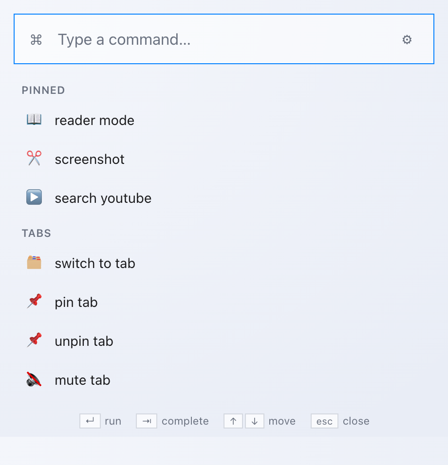
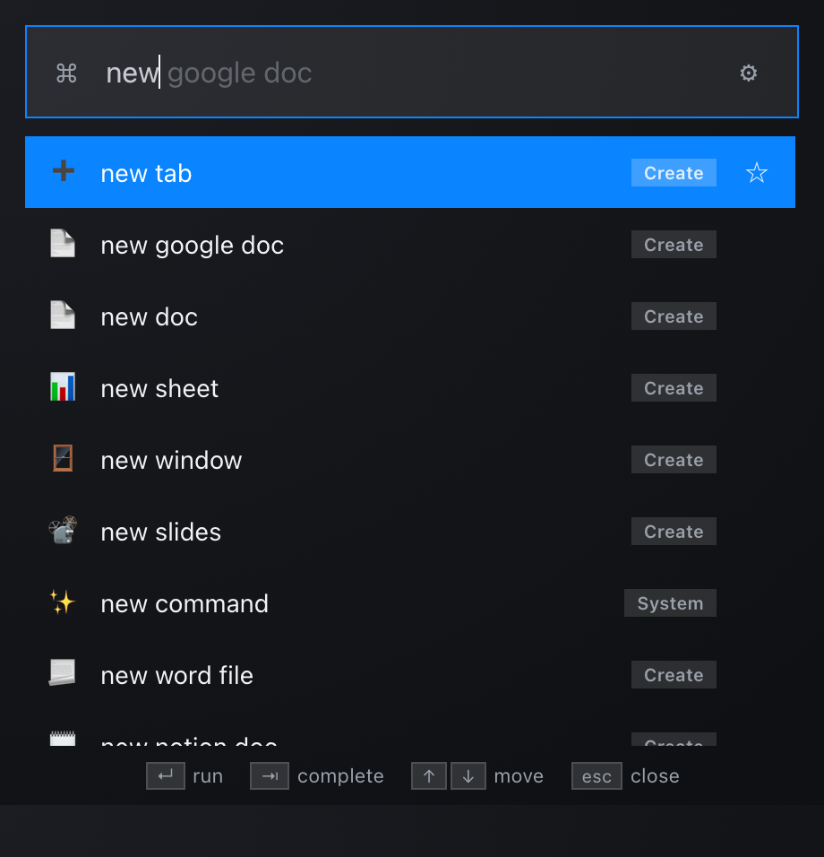
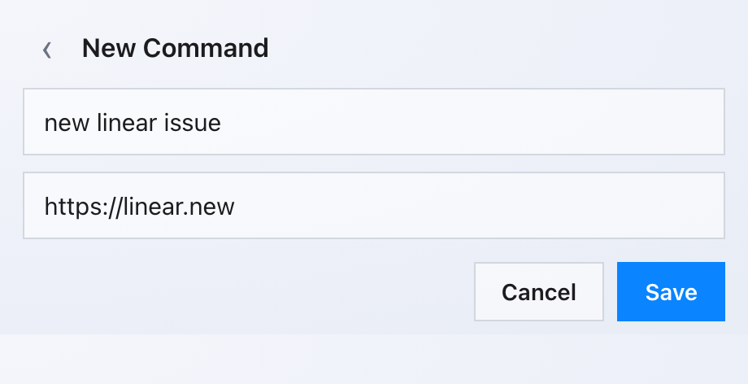
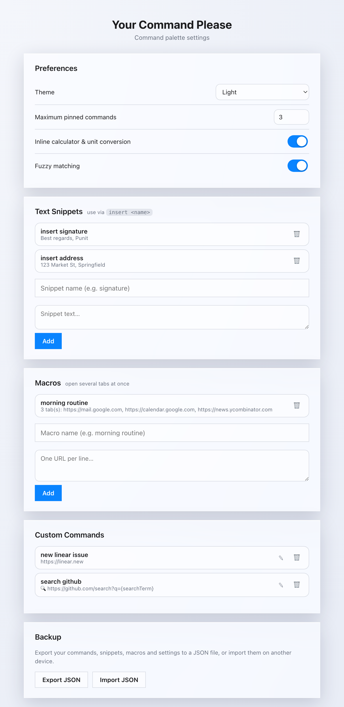

# Your Command Please

A Chrome extension command palette that lets you drive your browser with plain-text commands — no mouse required.

Open it with **⌘⇧Space** (Mac) or **Ctrl+Shift+Space** (Windows/Linux), type what you want, and hit Enter. Fuzzy matching, frecency-ranked results, an inline calculator, tab/bookmark search, snippets, and macros are all one keystroke away.

---

## Screenshots

| Command palette | Fuzzy search (dark) | Add a command | Settings |
|---|---|---|---|
|  |  |  |  |

---

## Highlights

- **Fuzzy matching** — type `ngd` to find `new google doc`. Results are ranked by relevance and **frecency** (how often/recently you use each command), with pinned commands first.
- **Autocomplete ghost** — the greyed-out completion after your text; press **Tab** to accept it.
- **Inline calculator & unit conversion** — type `20% of 240`, `12 * (3 + 4)`, or `10 km to mi` and press Enter to copy the result.
- **Tab switcher** — type `tab <query>` (or run **switch to tab**) to jump to any open tab by title or URL.
- **Go to** — type `goto <query>` to search your bookmarks and history and open a match.
- **Inline search** — type `search youtube lofi beats` to search a site directly, no second prompt.
- **Light / dark / auto themes**, adjustable from Settings.

---

## Built-in commands

| Category | Commands |
|---|---|
| **Create** | `new tab` · `new window` · `new google doc` / `sheet` / `slides` · `new word file` / `excel file` / `powerpoint presentation` · `new gmail message` · `new google calendar event` · `new notion doc` · `new figma project` · `new replit project` |
| **Navigate** | `history` · `downloads` · `chrome settings` · `passwords` · `extension manager` · `bookmark manager` · `goto` |
| **Tabs** | `switch to tab` · `pin tab` / `unpin tab` · `mute tab` / `unmute tab` · `duplicate tab` · `save all tabs` (bookmarks every tab in the window) |
| **Browser** | `clear cache` · `clear cookies` · `save bookmark` |
| **Page** | `screenshot` (select an area) · `copy screenshot` · `full page screenshot` · `reader mode` · `dark mode` · `link extract` · `copy url` · `copy page title` |
| **Search** | `search google` / `bing` / `youtube` / `amazon` / `flipkart` / `spotify` / `twitter` / `reddit` / `gmail` |
| **System** | `new command` · `new search command` · `extension settings` |

---

## Custom commands, snippets & macros

- **URL command** — type `new command`, then enter a name and the URL it should open.
- **Search command** — type `new search command`, then paste a search URL from the target site (search for `abc xyz pqr` there first and paste the resulting URL — the extension turns it into a reusable template).
- **Snippets** — save reusable text in Settings, then insert it into any field with `insert <name>`.
- **Macros** — save a group of URLs in Settings, then run the macro to open them all at once.

Manage snippets, macros and custom commands — and **export / import** everything as JSON — from the Settings page.

---

## Pinning & navigating

- Click the **☆ / ★** icon next to any command to pin it to the top (limit is configurable in Settings).
- Click **✎** to edit or **🗑** to delete a custom command.
- **↑ / ↓** to move through results, **Tab** to autocomplete, **Enter** to run, **Esc** to close.

---

## Keyboard shortcuts

The default palette shortcut is **⌘⇧Space** (Mac) / **Ctrl+Shift+Space** (others). Several commands (mute tab, clear cache/cookies, bookmark, reader mode, dark mode) can also be bound to their own shortcuts. Change any of them at `chrome://extensions/shortcuts`.

---

## Installation

1. Download or clone this repository.
2. Open `chrome://extensions` in Chrome.
3. Enable **Developer mode** (top-right toggle).
4. Click **Load unpacked** and select the `Your Command Please` folder.
5. Press **⌘⇧Space** / **Ctrl+Shift+Space** to open the palette.
